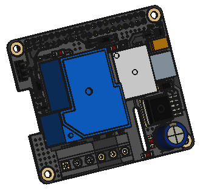
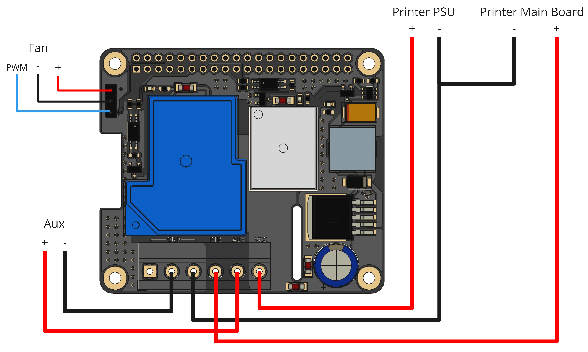

<p align="center">
  
</p>


# 3D Printer HAT

This 3D printer HAT allows you to power you Raspberry PI using your printers power supply. It also has relays which allows you to switch power to your printer so you can remotly turn it on and off.

## Board Features

- Step Down Voltage Converter - Converts the voltage supplied by your printer PSU down to the 5 volts required by the Raspberry Pi
- Reverse Polarity Protection - Protects your Pi just in case you make a mistake in the wiring
- Backpower Protection - Will stop providing power to your Pi if you power it from a USB connection
- Printer Power Switch - Switch power to your printers main board allowing you to remotly shutdown/startup your printer
- Auxilery Power Switch - Power on/off something else, maybe lights
- PWM Fan Connector - Connect a PWM fan to help keep your Pi cool

## Hardware Connection



## Software

### Klipper/Moonraker

Add the following power configuration to your moonraker.conf

```yaml
[power printer]
type: gpio
pin: !gpiochip0/gpio17
initial_state: on
off_when_shutdown: True
off_when_shutdown_delay: 0
on_when_job_queued: True
locked_while_printing: True
restart_klipper_when_powered: True
restart_delay: 1.

[power aux]
type: gpio
pin: !gpiochip0/gpio27
initial_state: off
off_when_shutdown: True
off_when_shutdown_delay: 0
```

To avoid backpowering the printer via the USB port we need to disable the ports when the power should be off, this can be achieved by using `uhubctl` (https://github.com/mvp/uhubctl)

To get started, SSH into your Rasperry Pi and instal uhubctl

```bash
sudo apt install uhubctl
```

At the moment Moonraker only supports controlling a small set of services, to get around this I created a `MoonCord` service as I wasn't using that plugin with this content

```
[Unit]
Description=USB Power

[Service]
ExecStart=sudo uhubctl -l 2 -a 1
ExecStop=sudo uhubctl -l 2 -a 0
RemainAfterExit=yes

[Install]
WantedBy=multi-user.target
```

Now add `bound_service: MoonCord` into the `power printer` section of the moonraker.conf

See https://moonraker.readthedocs.io/en/latest/configuration/ for more information

### Octoprint

TODO: Probably using PSU control plugin https://github.com/kantlivelong/OctoPrint-PSUControl

## Technical Specs

## Additional Content

### Enclosures

### PCB