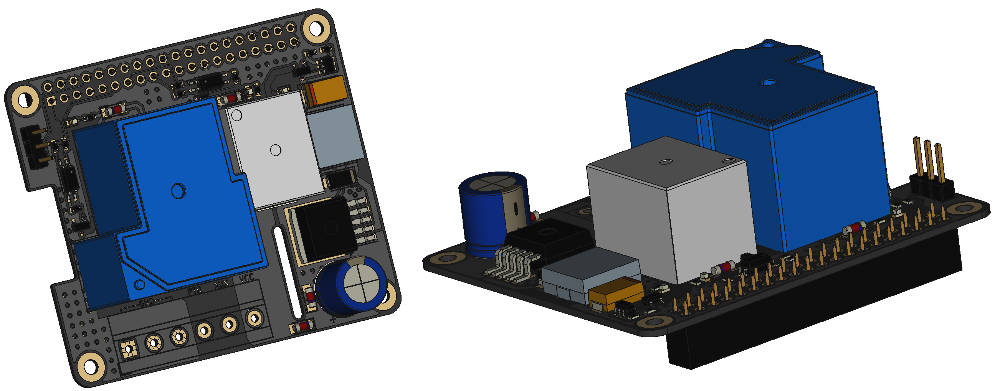

<p align="center">
  
</p>


# 3D Printer HAT

This 3D printer HAT is a PCB that allows you to connect your Raspberry PI to your 3D printer. The HAT (Hardware Attached on Top) sits on top of the Raspberry PI, allowing it to be powered by the printer's power supply. It also includes relays that allow the printer to be remotely turned on and off, making it easy to control your printer from your computer or mobile device.

## Board Features

- Step Down Voltage Converter: Converts the voltage supplied by your printer power supply unit (PSU) down to the 5 volts required by the Raspberry PI. This is an important safety feature, as using a higher voltage than the Raspberry PI is designed for can damage the board.
- Reverse Polarity Protection: Protects your Raspberry PI from damage in the event that the wiring is incorrectly connected. This can happen if you accidentally connect the positive and negative wires to the wrong pins on the HAT or the Raspberry PI.
- Backpower Protection: Will stop providing power to your PI via the HAT if you power it from a USB connection
- Printer Power Switch: Allows the power to the printer's main board to be remotely turned on and off. This is useful if you want to be able to start and stop your printer from your computer or mobile device.
- Auxiliary Power Switch: Can be used to power on and off an additional device, such as lights. This is useful if you want to be able to control other aspects of your printer setup from your computer or mobile device.
- PWM Fan Connector: Allows you to connect a pulse width modulation (PWM) fan to help keep the Raspberry PI cool. PWM fans are controlled by a signal from the Raspberry PI, which allows you to adjust their speed and therefore the amount of cooling they provide.

## Hardware Connection

To connect the HAT to your Raspberry PI and printer, you will need to follow the wiring diagram provided in the repository. This diagram shows you which pins on the HAT and the Raspberry PI need to be connected, as well as which wires from the printer's power supply need to be connected.


## Software

The HAT is compatible with the Klipper/Moonraker and Octoprint, which are open-source firmware and control software for 3D printers. Instructions for configuring these programs to work with the HAT are provided below.

### Klipper/Moonraker

To use the HAT with Klipper/Moonraker, you will need to add the following power configuration to your moonraker.conf file:

```yaml
[power printer]
type: gpio
pin: !gpiochip0/gpio17
initial_state: on
off_when_shutdown: True
off_when_shutdown_delay: 0
on_when_job_queued: True
locked_while_printing: True
restart_klipper_when_powered: True
restart_delay: 1.

[power aux]
type: gpio
pin: !gpiochip0/gpio27
initial_state: off
off_when_shutdown: True
off_when_shutdown_delay: 0
```

To avoid backpowering the printer via the USB port, we need to disable the ports when the power should be off. This can be achieved by using the `uhubctl` software, which is available at https://github.com/mvp/uhubctl.

To get started, SSH into your Raspberry PI and install uhubctl using the following command:

```bash
sudo apt install uhubctl
```

At the moment, Moonraker only supports controlling a small set of services. To get around this limitation, you can create a `MoonCord` service that can be used to control the USB ports. To do this, create a new file called MoonCord.service with the following content:

```
[Unit]
Description=USB Power

[Service]
ExecStart=sudo uhubctl -l 2 -a 1
ExecStop=sudo uhubctl -l 2 -a 0
RemainAfterExit=yes

[Install]
WantedBy=multi-user.target
```

Now add `bound_service: MoonCord` into the `power printer` section of the `moonraker.conf` file. This will cause the `MoonCord` service to be started and stopped along with the printer, allowing you to control the USB ports using the `uhubctl` software.

For more information about configuring Moonraker, see the documentation at https://moonraker.readthedocs.io/en/latest/configuration/.

### Octoprint

1. Install the PSU Control plugin by following the instructions at https://github.com/kantlivelong/OctoPrint-PSUControl.
2. Once the plugin is installed, you can access its settings by going to Settings > PSU Control in the Octoprint web interface.
3. In the plugin settings, enable the PSU Control feature and set the pin number for the printer power switch to 17 and the pin number for the auxiliary power switch to 27.
4. Save your changes and restart Octoprint.
5. Once Octoprint has restarted, you should be able to use the plugin to control the power to your printer and any other devices connected to the HAT. You can do this by going to the Control tab in the Octoprint web interface and clicking the on/off buttons for the printer and auxiliary power switches.

Note that this is just an example of how you might set up the HAT with Octoprint. The specific steps and settings may vary depending on your specific setup and requirements. For more detailed instructions, please refer to the documentation for the PSU Control plugin.

## Technical Specs

- Input Voltage: 4.5 V − 40 V
- Output Power: 5V DC / 3A
- Printer Output Max Current: 30A
- Aux Output Max Current: 10A

## Additional Content

The repository includes additional content that may be useful, including:

### Enclosures

- [Ender 3](enclosures/ender3)

### PCB

More information about the PCB and files required for manufacturing can be found [here](pcb)